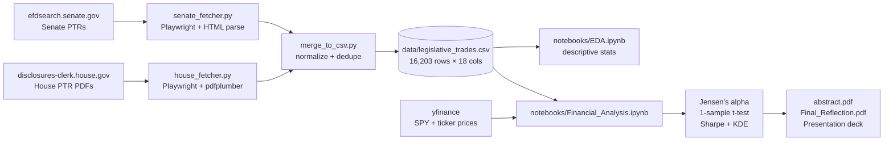

<picture>
  <source media="(prefers-color-scheme: dark)"  srcset="assets/banner-dark.svg"  type="image/svg+xml">
  <source media="(prefers-color-scheme: light)" srcset="assets/banner-light.svg" type="image/svg+xml">
  <source media="(prefers-color-scheme: dark)"  srcset="assets/banner-dark.png">
  <source media="(prefers-color-scheme: light)" srcset="assets/banner-light.png">
  
</picture>

[](https://github.com/Builder106/CapitolAlpha/actions/workflows/ci.yml)
[](https://github.com/Builder106/CapitolAlpha/actions/workflows/deploy.yml)
[](https://capitolalpha.vercel.app)
[](https://www.python.org/)
[](https://playwright.dev/python/)
[](#license)
[](https://www.wesleyan.edu/qac/)

> Members of Congress disclosed **16,203 stock trades** between 2020 and 2024. Their *purchases* beat the S&P 500 by an average of **+2.58%** over the following 90 days &mdash; statistically significant at p&nbsp;<&nbsp;0.05. This repo is the end-to-end pipeline behind that finding.

**Findings page:** [capitolalpha.vercel.app](https://capitolalpha.vercel.app) &mdash; the headline stat, the four charts, and the PDFs in one place. The Python pipeline that produced them lives in this repo.

## What this is

A semester project for **QAC 420 &mdash; *Data for Good*** at Wesleyan University. The course's frame is using public data to answer questions of civic accountability; this project asks one of the oldest of them: *do federal legislators have an investing edge they shouldn't?*

The answer is a reproducible Python pipeline that:

1. Scrapes Senate Periodic Transaction Reports (PTRs) directly from **efdsearch.senate.gov** (Playwright + form automation).
2. Scrapes House PTR PDFs from **disclosures-clerk.house.gov** (Playwright + `pdfplumber` table extraction).
3. Normalizes both chambers into a unified `legislative_trades.csv` (18 columns, 16,203 rows for 2020&ndash;2024).
4. Pulls market data via `yfinance` and computes Jensen's alpha, rolling 30/90/180-day returns, and a one-sample t-test against the S&P 500 benchmark.

Full deliverables:

- **[Abstract](docs/abstract/abstract.pdf)** &mdash; 1-page academic abstract.
- **[Final Reflection](docs/Final_Reflection/Final_Reflection.pdf)** &mdash; 5-page essay on method, ethics, and future work.
- **[Statistics writeup](docs/statistics/statistics.pdf)** &mdash; the formal statistical workup behind the Jensen's-alpha number.

## Key findings

| Metric | Congressional purchases | S&P 500 (benchmark) | Effect |
| --- | --- | --- | --- |
| Mean 90-day buy-and-hold ROI | **13.74%** | ~11.16% | +2.58 pp |
| **Jensen's alpha (90-day)** | &mdash; | &mdash; | **+2.58%** (p&nbsp;<&nbsp;0.05) |
| Pre-crash sell concentration | Top **5%** of sellers timed COVID exits before Feb&nbsp;20,&nbsp;2020 | &mdash; | suggestive, not causal |
| Trades analyzed | **220 benchmarkable purchases** out of 16,203 raw rows | &mdash; | &mdash; |
| Window | 2020-01-01 &ndash; 2024-12-31 | &mdash; | covers COVID + recovery |

The full statistical workup &mdash; t-statistic, confidence interval, Sharpe ratio, and the KDE of returns &mdash; is in [`notebooks/Financial_Analysis.ipynb`](notebooks/Financial_Analysis.ipynb).

## Pipeline



[`run_pipeline.py`](run_pipeline.py) is the orchestration entry point; the per-step modules live in [`pipeline/`](pipeline/). Unit tests for the fetchers and merge step are in [`tests/`](tests/).

## Reproducing the analysis

```bash
# 1. Environment
python3 -m venv .venv
source .venv/bin/activate
pip install -r requirements.txt
playwright install chromium

# 2. Fetch data (Option A: scrape official sites — slow, authoritative)
python -m pipeline.run_pipeline --use-official

# 2b. (Option B: pre-aggregated Senate JSON — fast, fallback)
python -m pipeline.run_pipeline

# 3. Run tests
pytest

# 4. Open the analysis notebooks
jupyter lab notebooks/Financial_Analysis.ipynb
```

Pipeline-level options (`--fresh`, `--senate-only`, `--house-only`) and source-fallback behavior are documented in [`pipeline/README_PIPELINE.md`](pipeline/README_PIPELINE.md).

## Caveats

This is an undergraduate course project, not a quantitative-research paper. The findings are best read as a starting point that justifies a deeper study, not a final claim:

- **Disclosure lag is large.** PTRs can be filed up to 30&ndash;45 days after a trade, so a 90-day alpha measured from the transaction date is *not* a 90-day alpha available to a public follower in real time. The signal is retrospective.
- **Selection bias on the benchmarked subset.** Only **220 trades** out of 16,203 had a clean ticker, sufficient price history in `yfinance`, and a clean entry/exit window. Heavy-tail trades (private placements, fund-of-fund holdings, options) are excluded.
- **No multiple-testing correction.** The 1-sample t-test against SPY at the 90-day horizon was the pre-registered question, but other horizons (30, 180 days) and per-legislator slices were also explored; results in those slices should be treated as exploratory.
- **Jensen's alpha assumes CAPM**, which is a strong assumption on a 220-trade sample over a window that includes both the COVID crash and the post-2020 recovery.
- **Ticker resolution is noisy.** PTR asset descriptions are often free-text ("Common Stock - Apple Inc.") rather than CUSIPs; the matcher resolves the obvious ones and drops the ambiguous ones.
- **Causality is unidentified.** Outperformance is consistent with non-public information, but it is also consistent with sector concentration, age/wealth effects, or skilled advisors. The data here cannot distinguish them.

The [Final Reflection PDF](docs/Final_Reflection/Final_Reflection.pdf) expands on all of these.

## Tech stack

- **Python 3.11+** with `pandas`, `scipy`, `matplotlib`, `seaborn`
- **Playwright** for browser automation on JavaScript-rendered disclosure sites
- **pdfplumber** for House PTR PDF table extraction
- **yfinance** for SPY and per-ticker price history
- **pytest** for unit tests on the fetchers and merge step
- **Jupyter** for the EDA and financial-analysis notebooks
- **Flourish** for the presentation visualization

## Acknowledgments

- The **Wesleyan QAC** for the *Data for Good* course frame and the methodological feedback through the semester.
- [`timothycarambat/senate-stock-watcher-data`](https://github.com/timothycarambat/senate-stock-watcher-data) as the JSON fallback when official scraping fails.
- The U.S. Senate Office of Public Records and the Office of the Clerk of the House for publishing the disclosure data that makes this analysis possible at all.

## License

Code released under the [MIT License](LICENSE). The underlying disclosure filings are public records in the public domain; the dataset assembled here (`data/legislative_trades.csv`) is released under the same terms.
